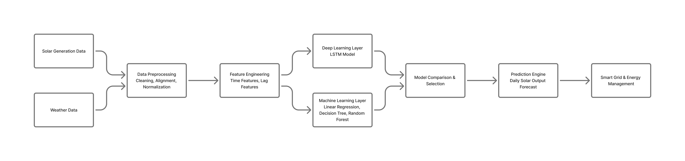
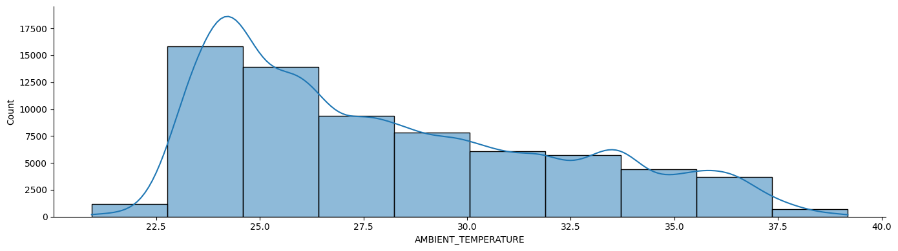
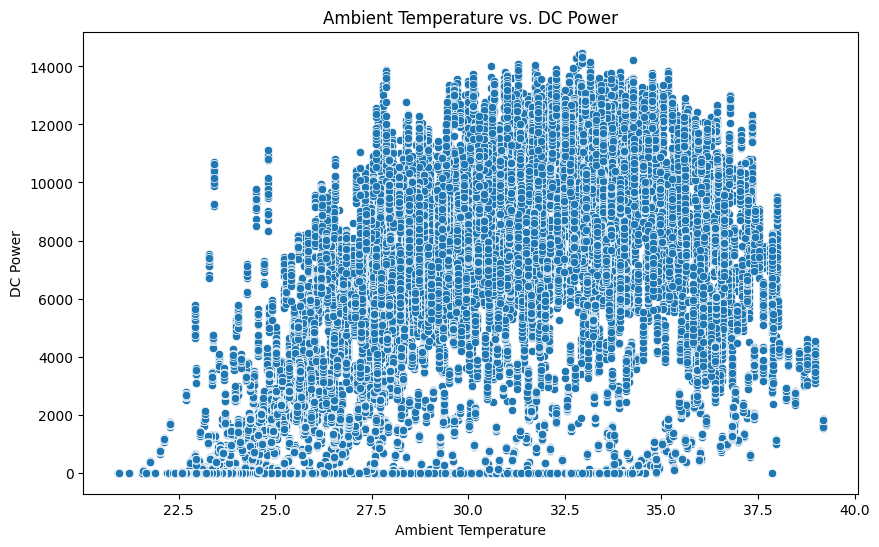
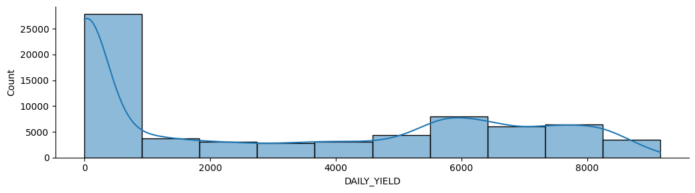
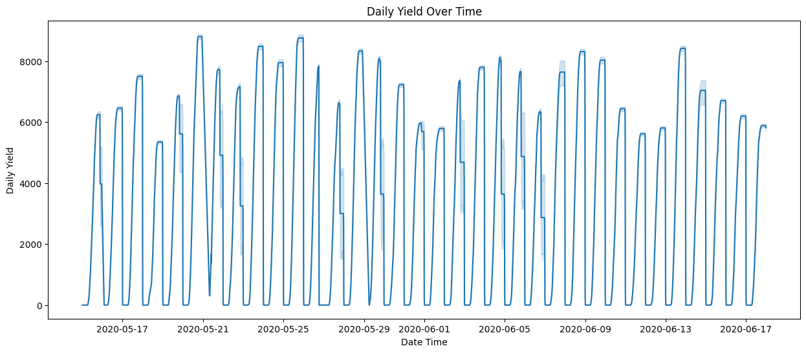
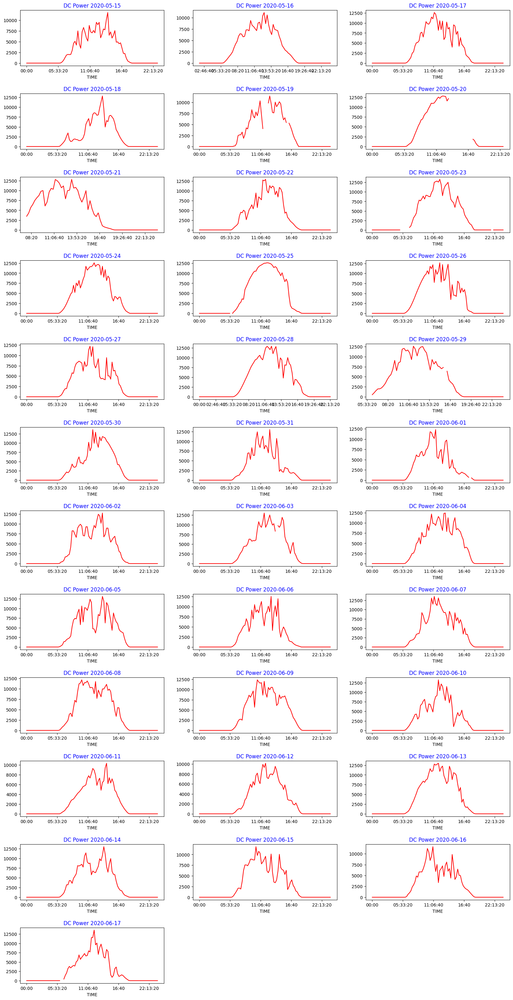
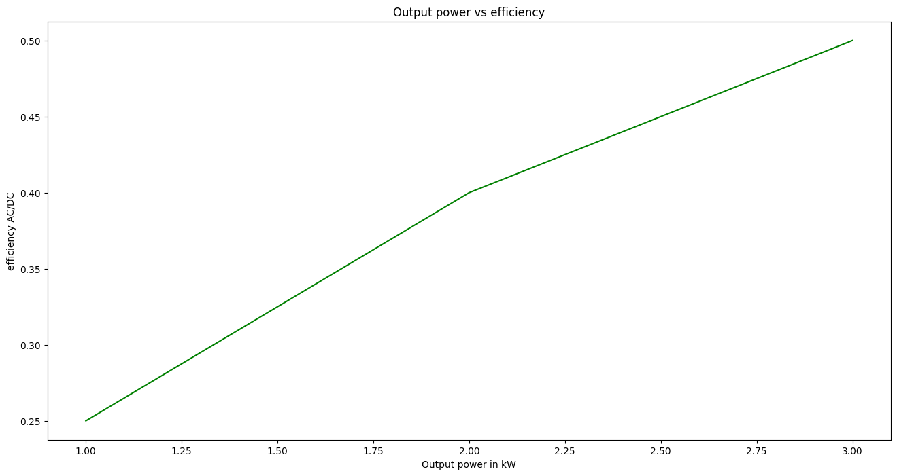
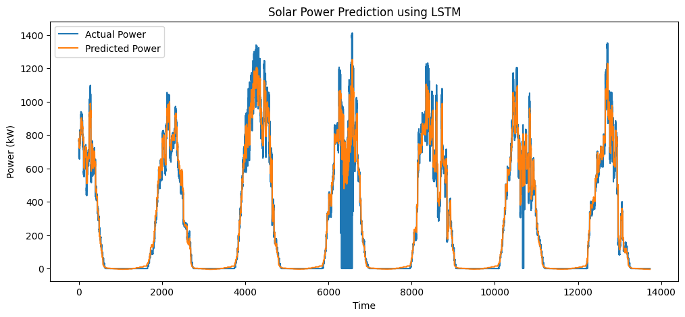

# ☀️ Optimizing Solar Power Generation and Distribution Using Machine Learning

This project predicts solar power generation using historical solar plant generation data and weather sensor data. It includes data preprocessing, exploratory data analysis (EDA), feature engineering, and the implementation of machine learning and deep learning models to forecast solar power output.

The project was developed as a B.Tech final-year project using **Google Colab**.

---

## 📌 Project Overview

Renewable energy sources such as solar power are highly dependent on weather conditions. Accurate prediction of solar energy generation helps improve energy planning and distribution.

In this project, solar generation data is combined with weather sensor data to build predictive models. Multiple machine learning algorithms and an LSTM neural network are implemented and their performance is evaluated using standard regression metrics.

---

## 🎯 Objectives

- Predict solar power generation using historical data.
- Analyze the relationship between weather conditions and solar power output.
- Perform data preprocessing and feature engineering.
- Compare different machine learning models.
- Implement an LSTM model for time-series prediction.

---

## 💻 Development Environment

- **Platform:** Google Colab
- **Language:** Python
- **Notebook Format:** Jupyter Notebook (.ipynb)

The entire project, including preprocessing, visualization, model training, and evaluation, was developed and executed using Google Colab.

---

## 📂 Dataset

This project uses the publicly available solar power generation dataset available on Kaggle.

**Dataset Reference:**

https://www.kaggle.com/code/pythonafroz/solar-power-generation-forecast/notebook

The repository includes the following dataset files:

- `Plant_1_Generation_Data.csv`
- `Plant_2_Weather_Sensor_Data.csv`

The datasets contain information such as:

- Date and Time
- DC Power
- AC Power
- Daily Yield
- Total Yield
- Irradiation
- Module Temperature
- Ambient Temperature

---

## 🛠 Technologies Used

- Python
- Google Colab
- Pandas
- NumPy
- Matplotlib
- Seaborn
- Plotly
- Scikit-learn
- TensorFlow
- Keras

---

## 📊 Project Workflow

1. Data Collection
2. Data Cleaning
3. Exploratory Data Analysis (EDA)
4. Feature Engineering
5. Data Preprocessing
6. Model Training
7. Model Evaluation
8. Solar Power Prediction

### Workflow Diagram

   

---

## 📈 Exploratory Data Analysis

The project includes:

- Missing value analysis
- Correlation analysis
- Distribution plots
- Heatmaps
- Time-series visualization
- Feature relationship analysis

---

## ⚙️ Feature Engineering

Several features were created during preprocessing to improve model performance, including:

- Time-based features
- Rolling statistics
- Lag features
- Inverter efficiency
- Temperature-related features

---

## 🤖 Models Implemented

### Machine Learning

- Linear Regression
- Decision Tree Regressor
- Random Forest Regressor

### Deep Learning

- Long Short-Term Memory (LSTM)

---

## 🧠 LSTM Training Configuration

| Parameter | Value |
|-----------|-------|
| Framework | TensorFlow / Keras |
| Epochs | 20 |
| Batch Size | 32 |
| Validation Split | 10% |
| Platform | Google Colab |

---

## 📊 Evaluation Metrics

The models were evaluated using:

- R² Score
- Mean Absolute Error (MAE)
- Mean Squared Error (MSE)
- Root Mean Squared Error (RMSE)

---

## 📁 Repository Structure

```text
solar-power-optimization/
│
├── README.md                          # Project documentation
│
├── data/
│   ├── Plant_1_Generation_Data.csv
│   └── Plant_2_Weather_Sensor_Data.csv
│
├── notebooks/
│   └── Solar_Power_Generation_Prediction.ipynb
│
├── images/
│   ├── ambient_temperature_distribution.png
│   ├── ambient_temp_vs_dc_power.png
│   ├── daily_yield_distribution.png
│   ├── daily_yield_over_time.png
│   ├── daywise_dc_power.png
│   ├── power_vs_efficiency.png
│   └── lstm_prediction.png
```

---

## ▶️ Running the Project

1. Clone this repository.

```bash
git clone https://github.com/Arghya-Biswas/solar-power-optimization.git
```

2. Open the notebook in **Google Colab** or Jupyter Notebook.

3. Ensure the dataset files are available in the working directory.

4. Run the notebook cells in sequence.

---

## 📌 Results

The project demonstrates the use of both traditional machine learning algorithms and an LSTM neural network for predicting solar power generation. Model performance is evaluated using standard regression metrics to compare prediction accuracy.

---

## 📷 Sample Visualizations

### Ambient Temperature Distribution



---

### Ambient Temperature vs DC Power



---

### Daily Yield Distribution



---

### Daily Yield Over Time



---

### Day-wise DC Power



---

### Power vs Efficiency



---

### LSTM Prediction



---

## 🙏 Acknowledgements

- Kaggle for providing the dataset.
- The following Kaggle notebook was used as a reference during the development of this project:

  https://www.kaggle.com/code/pythonafroz/solar-power-generation-forecast/notebook

---

## 👨‍💻 Author

**Arghya Biswas**

B.Tech Computer Science & Engineering (Artificial Intelligence & Machine Learning)

GitHub: https://github.com/Arghya-Biswas


